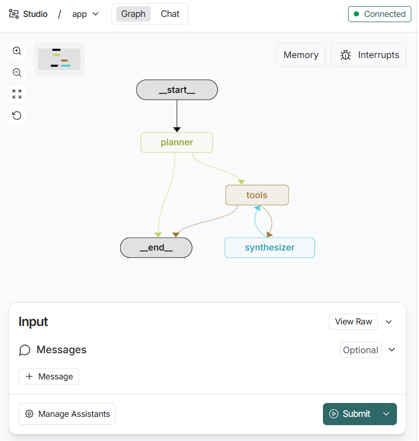

# Langraph studio basics

This project is a simple research and podcast generation workflow that uses LangGraph with the unique capabilities of Google's Gemini 2.5 model family. It combines three useful features of the Gemini 2.5 model family. You can pass a research topic. The system will then perform research on the topic using search, analyze the video, combine the insights, and generate a report with citations as well as a short podcast on the topic for you. It takes advantage of a few of Gemini's native capabilities:


## Quick Start

### Prerequisites

- Python 3.11+
- [uv](https://docs.astral.sh/uv/) package manager
- Google Gemini API key
- Tavily API key

### Setup

1. **Set up environment variables**:

Edit `.env` and [add your Google Gemini API key](https://ai.google.dev/gemini-api/docs/api-key):
```bash
GEMINI_API_KEY=your_api_key_here
```

3. **Run the development server**:

```bash
# Install uv package manager
curl -LsSf https://astral.sh/uv/install.sh | sh

# Install dependencies and start the LangGraph server
uvx --refresh --from "langgraph-cli[inmem]" --with-editable . --python 3.11 langgraph dev --allow-blocking
```

4. **Access the application**:

LangGraph will open in your browser.

```bash
╦  ┌─┐┌┐┌┌─┐╔═╗┬─┐┌─┐┌─┐┬ ┬
║  ├─┤││││ ┬║ ╦├┬┘├─┤├─┘├─┤
╩═╝┴ ┴┘└┘└─┘╚═╝┴└─┴ ┴┴  ┴ ┴

- 🚀 API: http://127.0.0.1:2024
- 🎨 Studio UI: https://smith.langchain.com/studio/?baseUrl=http://127.0.0.1:2024
- 📚 API Docs: http://127.0.0.1:2024/docs
```

5. Pass a `topic`.

Example:
* `topic`: What is Google's Gemini model and how does it compare to other LLMs?




**Key Capabilities:**
- 🔍 Performs real-time web searches using Tavily  
- 🧠 Uses Gemini 2.5 Pro for reasoning and synthesis  
- ✍️ Writes structured Markdown reports  
- 🕸️ Orchestrated via LangGraph for modular, explainable execution  

---

## ⚙️ Architecture

### 🧩 High-Level Design

```mermaid
flowchart TD
    A[🧑 User Request] --> B[🧭 Planner Node]
    B --> C[🔧 Tool Node]
    C --> D[🧠 Synthesizer Node]
    D --> E[🗂️ Report Writer]
    E --> F[✅ Markdown Report]


## Project Structure

multi-modal-researcher/
│
├── app.py                     # Main LangGraph workflow definition
├── langgraph.json             # Graph entrypoint configuration
├── pyproject.toml             # Project metadata and dependencies
├── .env                       # API keys (Gemini, Tavily)
├── research_report.md         # Generated Markdown report
└── README.md                  # This documentation file
